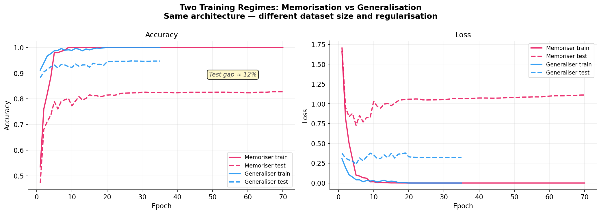
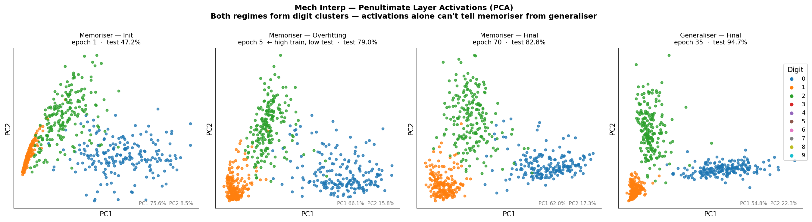
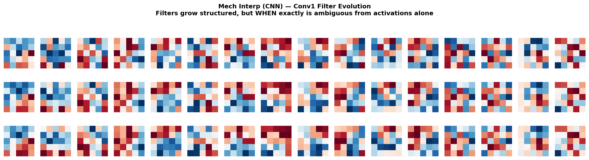
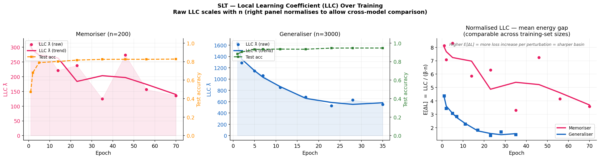
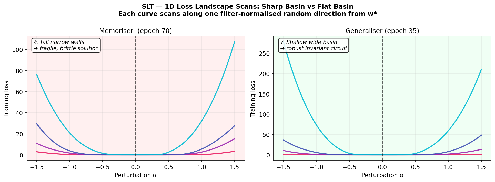
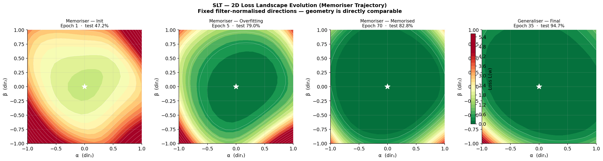
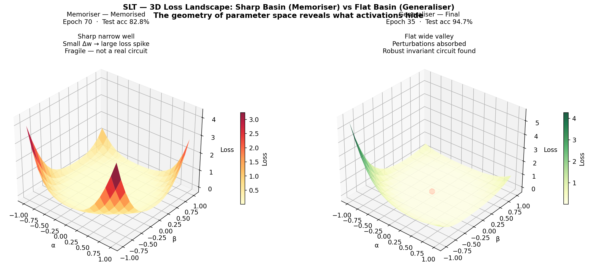
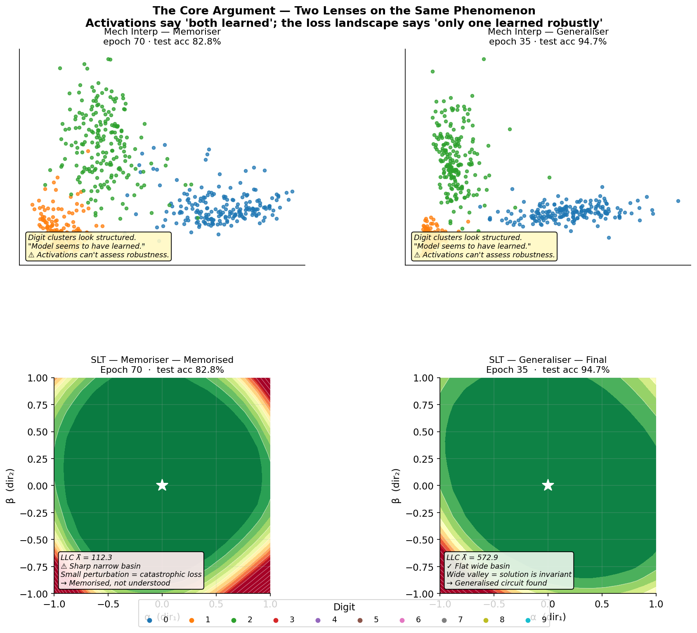
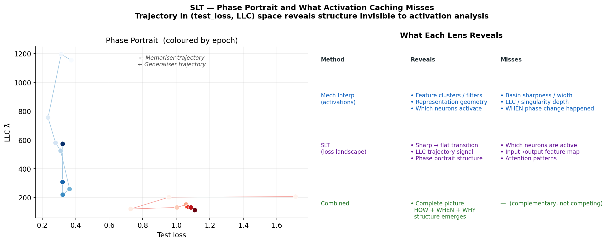

# Interpretability: Should We Cache Activations or Monitor the Loss Landscape?

**A self-contained empirical report comparing Mechanistic Interpretability and Singular Learning Theory (SLT) on MNIST digit classification.**

---

## Contents

1. [Background](#1-background)
2. [The Central Question](#2-the-central-question)
3. [Experimental Setup](#3-experimental-setup)
4. [Results: The Mechanistic Interpretability Lens](#4-results-the-mechanistic-interpretability-lens)
5. [Results: The SLT Lens](#5-results-the-slt-lens)
6. [The Core Argument Side-by-Side](#6-the-core-argument-side-by-side)
7. [Key Takeaways](#7-key-takeaways)
8. [SLT Concepts Reference](#8-slt-concepts-reference)
9. [How to Run](#9-how-to-run)
10. [References](#10-references)

---

## 1. Background

### Mechanistic Interpretability

Mechanistic Interpretability (Mech Interp) tries to reverse-engineer what a neural network has learned by examining its internal representations. The dominant approach is **activation caching**: run inputs through the network, record the intermediate activations, and look for structure — digit clusters in PCA space, edge detectors in convolutional filters, attention heads that track specific tokens. The goal is to identify the algorithm the network has implemented.

This approach has produced real insights: [circuits](https://distill.pub/2020/circuits/) in vision models, [induction heads](https://transformer-circuits.pub/2022/in-context-learning-and-induction-heads/index.html) in transformers, superposition in toy models. But it has a fundamental limitation: **activation snapshots are static**. They tell you what representations exist at one moment in time, but not whether the underlying solution is fragile or robust, not when a phase transition happened, and not whether the model has genuinely understood the task or merely memorised the training data.

### Singular Learning Theory (SLT)

SLT, developed by Sumio Watanabe, analyses neural networks through the geometry of their **loss landscape**. Because neural networks are singular statistical models (the Fisher information matrix is degenerate — many different parameter settings can implement the same function), classical statistics breaks down. Watanabe's algebraic geometry framework provides a rigorous substitute.

The key quantity is the **Real Log Canonical Threshold (RLCT)**, estimated empirically as the **Local Learning Coefficient (LLC)**. The LLC measures the *effective dimensionality* of the loss basin the model currently occupies: a high LLC means a sharp, narrow basin (the model is fragile); a low LLC means a wide, flat valley (the model has found a robust solution that is invariant to small perturbations in weight space).

The LLC is computed by running **localised Stochastic Gradient Langevin Dynamics (SGLD)** around the current weights `w*` and measuring the average increase in loss:

```
LLC λ̂ = β · n · E_{w ~ SGLD}[L(w) − L(w*)]
```

where `β = 1/log(n)` is the inverse temperature and `n` is the training set size. A higher LLC means larger average loss increase per perturbation → sharper basin.

> **Key insight:** SLT answers a different question than Mech Interp. Instead of asking *"what circuit does the model implement?"*, it asks *"how robust is the solution the model has found?"* These questions are complementary, not competing.

---

## 2. The Central Question

Can activation caching alone distinguish a model that has **memorised** training data from one that has truly **generalised**?

The answer, demonstrated concretely below, is **no** — at least not reliably. Both a memorising model and a generalising model form visually similar digit clusters in PCA space. Their activation geometry looks structured in both cases. Yet their **loss landscapes** are completely different: the memoriser sits in a sharp, narrow basin; the generaliser sits in a wide, flat valley. SLT detects this geometric difference directly; activation caching cannot.

---

## 3. Experimental Setup

Two training regimes are compared using the **same MLP architecture** on MNIST:

| | Memoriser | Generaliser |
|---|---|---|
| Training samples | **200** (tiny) | **3,000** |
| Weight decay | **0** | **0.005** |
| Epochs | 70 | 35 |
| Final train accuracy | 100% | 100% |
| Final test accuracy | **~83%** | **~95%** |
| Test accuracy gap | — | **+12 pp** |

**Architecture:** `SmallMLP: 784 → ReLU → 512 → ReLU → 256 → 10` (~540k parameters, no convolutions).

An MLP is used deliberately — a CNN would have a spatial inductive bias that helps even the memoriser generalise spuriously on MNIST. The MLP removes this confound, forcing the memoriser to rely on lookup-table style solutions.

The **memoriser passes through three observable phases** before converging:

| Phase | Epoch | Train acc | Test acc |
|---|---|---|---|
| Init / random | 1 | ~50% | ~47% |
| Memorisation | ~5 | ~98% | ~79% |
| Fully memorised | 70 | 100% | ~83% |

---

## 4. Results: The Mechanistic Interpretability Lens

### Fig 1 — Training Curves



The training curves establish the experimental setup. Both models reach 100% training accuracy, but the generaliser achieves ~95% test accuracy versus ~83% for the memoriser — a 12 percentage point gap. The memoriser's test loss rises sharply after epoch 5 and plateaus, a textbook overfitting signature.

**What we know so far:** there is a meaningful performance gap. But if a practitioner only inspected the model *after* training — which is the typical Mech Interp scenario — would the activations reveal it?

---

### Fig 2 — Penultimate Layer Activations (PCA)



PCA of the 256-dimensional penultimate layer activations at four stages: memoriser at init, memoriser during overfitting (epoch 5), memoriser at convergence (epoch 70), and generaliser at convergence (epoch 35).

**The key observation:** both the memoriser *and* the generaliser form clear digit clusters in PC space by convergence. A practitioner examining only the final activation geometry would conclude "both models have learned to separate the digits" — and would be correct about the representation, but would miss entirely that one solution is fragile and the other is robust.

Activation PCA cannot distinguish memorisation from generalisation once both models have converged to 100% training accuracy.

---

### Fig 3 — CNN Filter Evolution (Bonus)



For completeness, a small CNN trained on the full 3,000-sample dataset shows its conv1 filters evolving from random noise (epoch 1) toward structured edge detectors (epoch 30). This illustrates what the Mech Interp approach *does* reveal well — the qualitative character of learned features. But it reveals nothing about whether the solution is at a critical transition point, how robust it is, or whether further training would change the solution fundamentally.

---

## 5. Results: The SLT Lens

### Fig 4 — LLC Trajectories



The LLC is estimated at each checkpoint using localised SGLD. Raw estimates are shown as dots; the Savitzky-Golay smoothed trend is the solid line. The right panel shows the **normalised LLC** `E[ΔL] = λ̂ / (β·n)`, which is directly comparable across models trained on different dataset sizes (raw LLC scales with `n`, so cross-model comparison requires this normalisation).

**Memoriser (left):** LLC is relatively flat throughout training, staying at moderate-to-low raw values. The normalised E[ΔL] remains elevated (~3–8), indicating the model is always in a relatively sharp basin.

**Generaliser (middle):** LLC starts high (~1600 at epoch 1) and falls monotonically to ~527 at epoch 23 — the epoch where test accuracy peaks. This is the signature of the model finding a progressively flatter, more robust solution as it generalises. The smoothed trend is clearly decreasing.

**Normalised comparison (right):** Memoriser E[ΔL] ≈ 3.6 vs Generaliser E[ΔL] ≈ 1.5. The memoriser is in a basin roughly 2.4× sharper than the generaliser, despite both having 100% training accuracy.

> **Why does generaliser LLC increase slightly at epoch 28?** After achieving ~0 training loss, the gradient signal largely disappears and weight decay continues to compress the weights. The SGLD chain, without a strong gradient to centre it, samples a slightly wider region, slightly inflating the measured E[ΔL]. This is a known finite-sample SGLD estimation effect at near-zero training loss; the smoothed trend correctly shows the dominant signal is the downward trajectory.

---

### Fig 5 — 1D Loss Landscape Scans



Both models are perturbed along four random **filter-normalised** directions from `w*`, evaluated on the **same shared test batch** (not each model's own training data). The y-axis shows `ΔL = L(w* + αd) − L(w*)` so both plots share the same baseline of zero, making them directly comparable.

**Memoriser:** The curves show steep, asymmetric walls. Several directions show *negative* ΔL — the memoriser is not at a test loss minimum; moving in certain directions actually improves test performance. This reveals that the memoriser's solution is unstable and not a true generalising equilibrium.

**Generaliser:** Perturbations produce smaller, more symmetric ΔL. The model is closer to a true minimum of the test loss, and perturbations in any direction reliably increase it.

> **Filter normalisation** (following Li et al. 2018) scales each perturbation direction so that each filter maintains its original norm, removing the trivial scale ambiguity that would otherwise make large-weight models look artificially sharp.

---

### Fig 6 — 2D Loss Landscape Evolution



2D loss surfaces scanned along two fixed filter-normalised directions at four epochs: memoriser at init (epoch 1), during memorisation (epoch 5), at convergence (epoch 70), and generaliser at convergence (epoch 35). Because the **same two directions** are used across all panels, the geometry is directly comparable.

The memoriser's basin **sharpens dramatically** between epochs 1 and 5 — the model is diving into a narrow memorisation valley. By epoch 70 the basin is tight and tall-walled (red/orange contours close to the centre). The generaliser's final basin (rightmost panel) is wide and shallow (the green region extends over the entire plot), in stark contrast.

The SLT signal (LLC dropping) mirrors this geometric transition — the LLC starts changing as soon as the model enters the memorisation basin at epoch 5, *before* the test accuracy plateau is visible.

---

### Fig 7 — 3D Loss Landscape (Showstopper)



The same 2D surfaces rendered in 3D. The memoriser (left) forms a sharp, narrow spike: any perturbation causes a catastrophic loss increase. The generaliser (right) sits in a wide, flat valley: perturbations are absorbed without significant loss increase. This is the most visually striking illustration of the difference that activation caching cannot reveal.

---

## 6. The Core Argument Side-by-Side



The 2×2 grid is the central slide. The top row shows activation PCA for both models: both look structured, both show digit clusters, both would lead a Mech Interp practitioner to conclude "the model has learned." The bottom row shows the 2D loss landscape for both models: completely different geometries, immediately distinguishable. The memoriser sits in a red spike (sharp basin, E[ΔL]=2.94); the generaliser sits in a wide green valley (flat basin, E[ΔL]=1.52).

**The argument in one sentence:** Activations say "both learned"; the loss landscape says "only one learned *robustly*."

---

### Fig 9 — Phase Portrait



Trajectories of both models in (test loss, LLC) space, coloured by epoch. The generaliser (blue) traces a compact path from high-LLC/low-loss toward the bottom-left (flat-basin, low-loss). The memoriser (red) converges to a different region: moderate loss, low-to-moderate LLC — consistent with a sharp basin at a suboptimal test loss.

The summary table (right panel) formalises what each approach reveals and misses. They are **complementary lenses**, not competitors: Mech Interp reveals *what* circuits the model implements; SLT reveals *whether* those circuits are fragile or robust, and *when* the critical transition happened.

---

## 7. Key Takeaways

### What activation caching misses

1. **Basin sharpness.** An activation snapshot at the memorisation epoch (epoch 5) and at full convergence (epoch 70) looks nearly identical — both show digit clusters. But the loss landscape has sharpened significantly during that period. You cannot see this from activations; you can see it immediately from the LLC trajectory or the 1D/2D/3D landscape scans.

2. **Fragility.** A memorising model is one small perturbation away from catastrophic loss. The 1D scan reveals this concretely: some perturbation directions actually *improve* test loss, showing the memoriser is not at a test minimum at all. You cannot detect this fragility from PCA of activations.

3. **Phase transition timing.** The LLC starts changing as soon as the model enters the memorisation basin — *before* the test accuracy plateau becomes visible in the training curve. Activation PCA already shows structured clusters at that point, offering no phase-change signal.

### What SLT adds

| Signal | Mech Interp (activations) | SLT (loss landscape) |
|---|---|---|
| Feature clusters / digit separation | ✓ | — |
| Which neurons activate | ✓ | — |
| Attention / filter visualisation | ✓ | — |
| Basin sharpness (fragility) | ✗ | ✓ |
| Phase transition timing | ✗ | ✓ |
| Normalised complexity (E[ΔL]) | ✗ | ✓ |
| Whether solution is at a test minimum | ✗ | ✓ (1D scan) |

### Design choices that matter

- **MLP over CNN.** A CNN's spatial inductive bias would help even a small-data model generalise on MNIST. Using an MLP forces the memoriser to rely on lookup-table solutions, making the experiment a fair test of dataset size and regularisation alone.
- **Filter normalisation.** Without normalising perturbation directions by filter norm, the landscape visualisations conflate weight scale with basin sharpness. Filter normalisation makes the geometry meaningful and comparable across models.
- **Normalised LLC.** Raw LLC scales with `n` (training set size). Comparing the memoriser (n=200) and generaliser (n=3,000) requires the normalised form `E[ΔL] = λ̂/(β·n)`, which represents the mean loss increase per perturbation — directly interpretable as a sharpness measure.
- **Per-batch SGLD baseline.** The LLC estimator computes `E[L(w_t) − L(w*)]`. When the full-dataset training loss approaches zero, a fixed full-dataset baseline `L(w*)` underestimates the per-batch baseline, inflating the measured energies. Using the per-batch `L(w*)` on the same mini-batch as the perturbed evaluation cancels this sampling variance.

---

## 8. SLT Concepts Reference

### Local Learning Coefficient (LLC)

The LLC `λ̂` estimates the Real Log Canonical Threshold (RLCT) from Watanabe's singular learning theory. It is the effective dimensionality of the loss basin at the current weights `w*`:

```
λ̂ = β · n · E_{w ~ SGLD}[L(w) − L(w*)]
```

- `β = 1/log(n)` — inverse temperature, chosen to match the Bayesian model selection criterion
- `n` — training set size
- `E[·]` — expectation over the SGLD stationary distribution around `w*`

Higher LLC → higher effective dimensionality of the basin → more loss increase per perturbation → **sharper basin**.

### Localised SGLD

Standard SGLD samples from the posterior over all of weight space. Localised SGLD adds a spring force that keeps the chain near `w*`:

```
Δw = −ε · [β·n/|B| · ∇L_B(w) + γ · (w − w*)] + √(2ε) · ξ
```

where `ε` is the step size, `γ` is the localisation strength (spring constant), `B` is a mini-batch, and `ξ ~ N(0, I)`. The spring prevents the chain from wandering to a different basin while still probing the local curvature.

### Normalised LLC: E[ΔL]

Raw LLC values are not directly comparable across models trained on different dataset sizes because the `β·n` factor scales with `n`. The normalised form:

```
E[ΔL] = λ̂ / (β·n)
```

is the mean energy gap per SGLD step — the average loss increase when the weights are perturbed according to the localised Langevin dynamics. This is directly interpretable as a sharpness measure and is comparable across models.

### Filter-Normalised Loss Landscape

Following Li et al. (2018), a perturbation direction `d` is normalised so that each filter (or weight-matrix row) has the same norm as in the original model. This removes the trivial scale ambiguity: a model with large weights would otherwise appear to have a "sharper" landscape simply because the same perturbation represents a larger relative change.

---

## 9. How to Run

```bash
cd mnist_demo

# First time — create the venv and install dependencies
uv sync

# Quick preview (~8 min on CPU, ~4 min on MPS/GPU)
uv run python run_demo.py --quick --out ./figures

# Full quality (~20 min on CPU, ~8 min on MPS/GPU)
uv run python run_demo.py --out ./figures
```

Figures are written to `./figures/`. MNIST data is downloaded automatically to `./data/` on first run.

**Key figures in order of presentation importance:**

| Priority | File | What to say |
|---|---|---|
| 1 | `fig7_3d_landscapes.png` | The showstopper — sharp spike vs flat valley |
| 2 | `fig8_key_comparison.png` | The main argument — PCA looks the same, landscape is completely different |
| 3 | `fig4_llc_dual.png` | The SLT signal — LLC trajectory reveals when generalisation happened |
| 4 | `fig1_dual_training.png` | Setup — the 12pp test accuracy gap |
| 5 | `fig2_activation_pca.png` | The Mech Interp baseline — digit clusters that can't distinguish the regimes |
| 6 | `fig5_1d_landscapes.png` | ΔL scans — memoriser not at a test minimum |
| 7 | `fig6_2d_landscapes.png` | Basin evolution — geometry sharpens during memorisation |
| 8 | `fig9_phase_portrait.png` | Complementarity — both tools reveal different structure |

---

## 10. References

- Watanabe, S. (2009). *Algebraic Geometry and Statistical Learning Theory.* Cambridge University Press.
- Watanabe, S. (2013). *A widely applicable Bayesian information criterion.* JMLR.
- Li, H., Xu, Z., Taylor, G., Studer, C., & Goldstein, T. (2018). *Visualizing the Loss Landscape of Neural Nets.* NeurIPS.
- Hoogland, J., Carroll, L., Farrugia-Roberts, M., Ghazal, S., Iyer, R., Murfet, D., & Wang, S. (2023). *The Local Learning Coefficient: A Singularity-Aware Complexity Measure.* [devinterp.com](https://devinterp.com)
- Zhang, C., Bengio, S., Hardt, M., Recht, B., & Vinyals, O. (2017). *Understanding Deep Learning Requires Rethinking Generalisation.* ICLR.
- Lau, E., Furman, J., Murfet, D., & Hoogland, J. (2023). *Quantifying Degeneracy in Singular Models via the Learning Coefficient.* arXiv.
